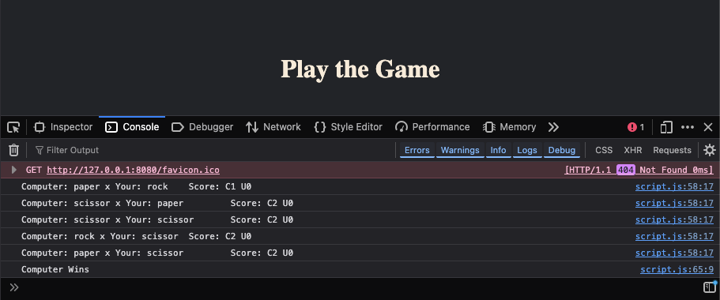

# Rock Paper Scissors Game 🎮 ✊📄✂️

A simple Rock Paper Scissors game built using **vanilla JavaScript**.  
The game runs in the browser and plays 5 rounds between the user and the computer, with results logged to the console.

---

## 🔧 How It Works

1. **getUserChoice()**  
   Prompts the user to choose between:
   - `1` for Rock
   - `2` for Paper
   - `3` for Scissors

2. **getComputerChoice()**  
   Uses `Math.random()` to generate a random number between 1 and 3 (inclusive) representing the computer's choice.

3. **playRound(userChoice, computerChoice)**  
   Implements the logic of a single round of the game, handling all possible outcomes (win/lose/draw).

4. **playGame()**  
   Plays the game for 5 rounds and logs the result of each round to the console.

---

## 🚀 Getting Started

To run the game locally:

1. Clone the repository or download the files.
2. Open `index.html` in your browser.
3. You’ll see the image `prompt.png` (which explains what to do).
4. Open the browser **Console** (press F12 or right-click → Inspect → Console).
5. Follow the prompts to play the game!

---

## 🧠 Note

- This is a beginner-friendly project meant to practice JavaScript fundamentals like:
  - Functions
  - Conditionals
  - Math.random
  - Prompt input
  - Console output

---

## 🖼 Screenshot

Here’s what the prompt looks like:

And this is a sample output in the console:

---

## 📌 Future Improvements

- Add a graphical UI with buttons instead of `prompt()`
- Track and display scores visually
- Add restart functionality

---

Happy coding! 🎉
